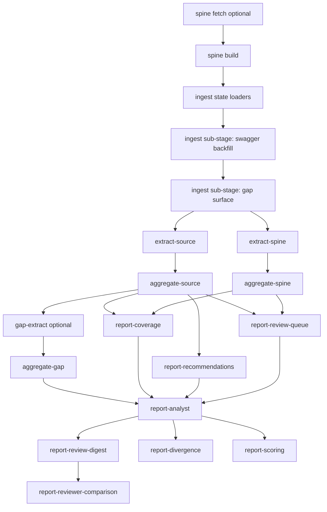
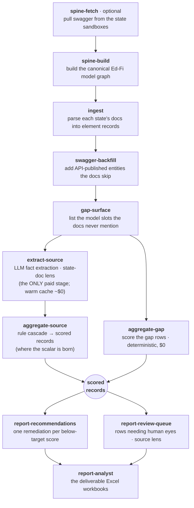

# Metadata-Catalog Orchestrated Flow — Commands and Table Hydration

Purpose: one operator-facing runbook covering both the **full pipeline** and the
**lite (score-only) path** — showing all pipeline stages, the `mc.exe` command
path, and which PostgreSQL tables are hydrated at each stage.

**Two paths at a glance:**

| | Full pipeline | Lite path |
|---|---|---|
| Command | `mc.exe publish --yes` | `mc.exe publish --lite --yes` |
| LLM stages | source lens + spine lens | source lens only (~half the cost) |
| Reports | all reports | recommendations, source review queue, analyst workbooks |
| Use when | you need API-model-lens analysis, coverage, divergence, reviewer comparison | you need the scalar NACHOS score and analyst workbooks only |

The lite path is a _path through_ the full pipeline, not a fork — lite scores
are byte-identical to full-pipeline scores.

---

## Part 1 — Full Pipeline

### Single Command

Use `publish` as the default run path because it executes ordered stages and
records cross-stage lineage in one place.

```powershell
.\.venv\Scripts\mc.exe publish --yes
```

Useful variants:

```powershell
# Plan only (no writes)
.\.venv\Scripts\mc.exe publish --dry-run

# Resume from a failed/changed stage
.\.venv\Scripts\mc.exe publish --from extract-source --yes

# Reports refresh only
.\.venv\Scripts\mc.exe publish --reports-only --yes
```

### End-to-End Stage Flow



### Stage Commands (Manual Equivalents)

These are the manual equivalents for the same stage families that `publish`
orchestrates.

```powershell
# Spine — per-state only (no --state all); repeat per state.
# TX fetch needs the local TSDS Docker stack.
.\.venv\Scripts\mc.exe spine fetch --state AZ
.\.venv\Scripts\mc.exe spine build --state AZ

# Ingest
.\.venv\Scripts\mc.exe ingest az
.\.venv\Scripts\mc.exe ingest wi
.\.venv\Scripts\mc.exe ingest mn
.\.venv\Scripts\mc.exe ingest tx
.\.venv\Scripts\mc.exe ingest in
.\.venv\Scripts\mc.exe ingest swagger-backfill --state all
.\.venv\Scripts\mc.exe ingest gap --state all

# Facts and scoring
.\.venv\Scripts\mc.exe score run-all --state all --lens source --facts all --yes --cost-cap 80
.\.venv\Scripts\mc.exe score run-all --state all --lens spine  --facts all --yes --cost-cap 80
.\.venv\Scripts\mc.exe score aggregate --state all --lens source
.\.venv\Scripts\mc.exe score aggregate --state all --lens spine

# Optional gap scoring path
.\.venv\Scripts\mc.exe score gap-extract --state all --with-llm --prompt-version step3.full.v1
.\.venv\Scripts\mc.exe score aggregate-gap --state all

# Reports — recommendations + review-queue BEFORE analyst (the workbook
# joins both)
.\.venv\Scripts\mc.exe report coverage --lens source
.\.venv\Scripts\mc.exe report coverage --lens spine
.\.venv\Scripts\mc.exe report recommendations --state all
.\.venv\Scripts\mc.exe report review-queue --lens source
.\.venv\Scripts\mc.exe report review-queue --lens spine
.\.venv\Scripts\mc.exe report analyst --all
.\.venv\Scripts\mc.exe report review-digest --lens source
.\.venv\Scripts\mc.exe report review-digest --lens spine
.\.venv\Scripts\mc.exe report reviewer-comparison
.\.venv\Scripts\mc.exe report divergence
.\.venv\Scripts\mc.exe report scoring --lens spine
```

### Table Hydration Matrix

Reference source: [Database entity details](./Database-entity-details.md).

| Stage family | Primary command path | Hydrated table(s) | Write pattern |
|---|---|---|---|
| Spine + Ingest | `mc.exe publish` (stages: `spine-build`, `ingest`, `swagger-backfill`, `gap-surface`) | `source_elements`, `spine_elements`, `ingestion_status`, `gap_logs` | `source_elements` / `spine_elements` snapshot-replace per state; `ingestion_status` upsert per `(state,lens)`; `gap_logs` replace per state |
| Phase-A fact extraction | `mc.exe publish` (stages: `extract-source`, `extract-spine`) | `fact_runs`, `fact_observations` | New run + observation snapshot for current state/lens/fact set |
| Phase-C scoring aggregate | `mc.exe publish` (stages: `aggregate-source`, `aggregate-spine`, `aggregate-gap`) | `score_records`, `score_status` | `score_records` snapshot-replace per `(state,lens)`; `score_status` upsert per `(state,lens)` |
| Reporting surfaces | `mc.exe publish` (report stages) | No additional DB hydration required | Reads hydrated scoring/ingest artifacts and emits report artifacts |

### Lineage and Freshness Guidance

1. Use `mc publish` as the single orchestrated run, since it executes stages
   and writes lineage together.
2. If you already ran ingest/scoring manually, run `publish` afterward to
   generate or refresh canonical lineage for that sequence.
3. `ingestion_status` and `score_status` can exist earlier, but they are stage
   summaries; canonical cross-stage freshness comes from the publish manifest.

### Quick Operator Checklist

- Run `mc.exe publish --dry-run` to verify planned stages.
- Run `mc.exe publish --yes` for the canonical lineage-bearing execution.
- If a stage fails, resume with `mc.exe publish --from <stage> --yes`.
- Treat the publish manifest as the authoritative cross-stage freshness signal.
- Curation writes are tracked inputs: after `review correct-fact` (or the first
  curation sidecar appearing), the next publish re-runs aggregate onward —
  that is the correction being applied, not staleness drift.

---

## Part 2 — Lite Path (Score-Only)

The shortest operator path from a state's documentation to the Adjusted NACHOS
Score in the analyst workbooks, with PostgreSQL tables hydrated at each stage.
`--lite` is a profile of the same `publish` orchestrator — ordered stages,
skip-if-fresh, cross-stage lineage in the manifest, the LLM confirmation gate
and `--cost-cap` all work the same.

What the lite profile cuts relative to the full flow: `extract-spine` +
`aggregate-spine` (the second API-model-lens scoring pass), `report-coverage`,
`report-review-digest`, `report-reviewer-comparison`, `report-divergence`, and
`report-scoring`.

### Single Command

```powershell
.\.venv\Scripts\mc.exe publish --lite --yes
```

Useful variants:

```powershell
# Plan only (no writes) — shows exactly which stages lite runs vs cuts
.\.venv\Scripts\mc.exe publish --lite --dry-run

# Resume from a failed/changed stage (lite stage names only)
.\.venv\Scripts\mc.exe publish --lite --from extract-source --yes

# Reports refresh only — resolves to report-recommendations, not report-coverage
.\.venv\Scripts\mc.exe publish --lite --reports-only --yes

# Refetch swagger first (TX needs the local TSDS stack)
.\.venv\Scripts\mc.exe publish --lite --refresh-spine --yes
```

> **Flags that do NOT compose with `--lite`:** `--with-gap-llm` and
> `--with-spine-workbooks` are full-edition flags and will error under `--lite`.

### End-to-End Stage Flow (Lite)



`gap-surface` and `aggregate-gap` survive the cut because they are free and
deterministic, and the analyst workbook's **Documentation Gaps** sheet reads the
gap records — cutting them would let that sheet go silently stale after a
re-ingest.

### Stage Commands (Manual Equivalents)

Prefer `publish --lite` for real runs; these are for partial reruns and
understanding.

```powershell
# Spine — fetch swagger, then build the canonical model graph.
# Per-state only (no --state all). TX fetch needs the local TSDS Docker stack.
# Writes: spine JSON under data/spine/ -> hydrates spine reference data.
.\.venv\Scripts\mc.exe spine fetch --state AZ
.\.venv\Scripts\mc.exe spine build --state AZ

# Ingest — parse each state's published docs into normalized element records.
# One pass writes BOTH lens artifacts; lite only ever scores the source one.
# Writes: {state}_elements_source.json + {state}_elements_spine.json
#   -> source_elements / spine_elements.
.\.venv\Scripts\mc.exe ingest az
.\.venv\Scripts\mc.exe ingest wi
.\.venv\Scripts\mc.exe ingest mn
.\.venv\Scripts\mc.exe ingest tx
.\.venv\Scripts\mc.exe ingest in

# Swagger backfill — append rows for entities the API publishes but the source
# doc never mentions (documented=False; audit surface, not authored documentation).
.\.venv\Scripts\mc.exe ingest swagger-backfill --state all

# Gap surface + deterministic gap scoring ($0) — feeds the workbook's
# Documentation Gaps sheet.
# Writes: gap artifacts -> gap_logs; gap score sidecars -> score_records.
.\.venv\Scripts\mc.exe ingest gap --state all
.\.venv\Scripts\mc.exe score aggregate-gap --state all

# Fact extraction — the ONLY stage that spends money (prompt-cached; warm
# reruns ~$0). SOURCE LENS ONLY in lite — halves LLM spend vs a cold full run.
# Writes: per-fact artifacts -> fact_runs / fact_observations.
.\.venv\Scripts\mc.exe score run-all --state all --lens source --facts all --yes --cost-cap 80

# Aggregate — overlays any same-lens analyst fact corrections onto the fact
# pool, then runs the deterministic rule cascade; one scored
# record per element. Where the scalar is born.
# Writes: {state}_scores_source.json sidecars -> score_records / score_status.
.\.venv\Scripts\mc.exe score aggregate --state all --lens source

# Reports — recommendations + review-queue BEFORE analyst (the workbook joins
# both). Pass --lens source explicitly to review-queue (its CLI default is spine).
.\.venv\Scripts\mc.exe report recommendations --state AZ
.\.venv\Scripts\mc.exe report review-queue --lens source
.\.venv\Scripts\mc.exe report analyst --all
```

### On-Demand Commands (outside the lite chain)

```powershell
# Audit workbook — every element with each dimension's firing rule, consumed
# facts, and confidence. Where a contested score gets settled.
.\.venv\Scripts\mc.exe report audit --state WI

# Analyst curation round-trip — read the green analyst-input band back from
# a returned workbook (incl. both score-override axes, Adjusted and Base);
# edits survive every regeneration.
# Hydrates: curation_records.
.\.venv\Scripts\mc.exe review ingest data\out\wi_analyst.xlsx

# Team-consensus adjudication — record an agreed adjusted score for one
# contested row. Writes an `adjudication` block into
# data/curation/{state}.json with who agreed, why, and the engine score +
# plan version at decision time. The engine score is never modified — the
# consensus renders as `Effective Score (adjudicated)` beside it, and if the
# engine score or plan version later moves, the adjudication goes stale and
# the row re-enters the Review Queue as RE-ADJUDICATE.
.\.venv\Scripts\mc.exe review adjudicate --state tx --entity "BasicReportingPeriodAttendance" --element "CalendarCode" --value 2.0 --agreed-by <reviewer-name-1> --agreed-by <reviewer-name-2> --rationale "..."

# Fact-level correction — fix one wrong LLM-extracted fact.
# Writes a `facts` block into the same sidecar; the next `score aggregate`
# overlays the corrected value onto the fact pool BEFORE the rule cascade
# runs, so the score recomputes with `human_corrected` provenance. The prompt
# cache is never rewritten, and deterministic facts are rejected (a wrong
# deterministic fact is a code bug, not a curation entry).
.\.venv\Scripts\mc.exe review correct-fact --state tx --entity "BasicReportingPeriodAttendance" --element "CalendarCode" --fact has_conditional_logic --value false --author <reviewer-name> --rationale "..."

# Human-vs-AI comparison — works against lite outputs, but requires the
# hand-placed reviewer workbooks under docs/human-scored-files/ (not in git).
.\.venv\Scripts\mc.exe report review-digest --lens source
```

### Table Hydration Matrix (Lite)

Reference source: [Database entity details](./Database-entity-details.md).
Identical write patterns to the full edition; the lite differences are which
rows exist.

| Stage family | Primary command path | Hydrated table(s) | Lite difference |
|---|---|---|---|
| Spine + Ingest | `publish --lite` (stages: `spine-build`, `ingest`, `swagger-backfill`, `gap-surface`) | `source_elements`, `spine_elements`, `ingestion_status`, `gap_logs` | none — ingest hydrates both element tables in one pass |
| Phase-A fact extraction | `publish --lite` (stage: `extract-source`) | `fact_runs`, `fact_observations` | source-lens runs only; no spine-lens fact rows |
| Phase-C scoring aggregate | `publish --lite` (stages: `aggregate-source`, `aggregate-gap`) | `score_records`, `score_status` | `(state, source)` + gap records only; no `(state, spine)` rows |
| Reporting surfaces | `publish --lite` (report stages) | none (reads hydrated artifacts, emits report artifacts) | recommendations, source-lens review queue, analyst workbooks only |
| Analyst curation (on demand) | `review ingest <workbook>` / `review adjudicate` / `review correct-fact` | `curation_records` | none |

### Quick Operator Checklist (Lite)

- `mc.exe publish --lite --dry-run` — verify the plan: score-only stages show
  `would_run`/`skipped_fresh`, everything else `skipped_disabled`.
- `mc.exe publish --lite --yes` — the canonical lineage-bearing lite run. Only
  `extract-source` spends money; warm reruns are ~$0.
- Stage fails → resume with `mc.exe publish --lite --from <stage> --yes` (lite
  stage names only).
- The publish manifest is the authoritative freshness signal — lite and full
  runs share it, so switching between them re-runs exactly what drifted.
- Curation writes are tracked inputs: after `review correct-fact` (or the first
  curation sidecar appearing), the next publish re-runs aggregate onward —
  that is the correction being applied, not staleness drift.
- On manual runs, the one ordering rule that still applies in lite:
  recommendations + review-queue **before** analyst. Pass `--lens source` to
  `report review-queue` (its CLI default is spine).
- After analysts hand a workbook back, run `review ingest` — same as the full
  edition.
